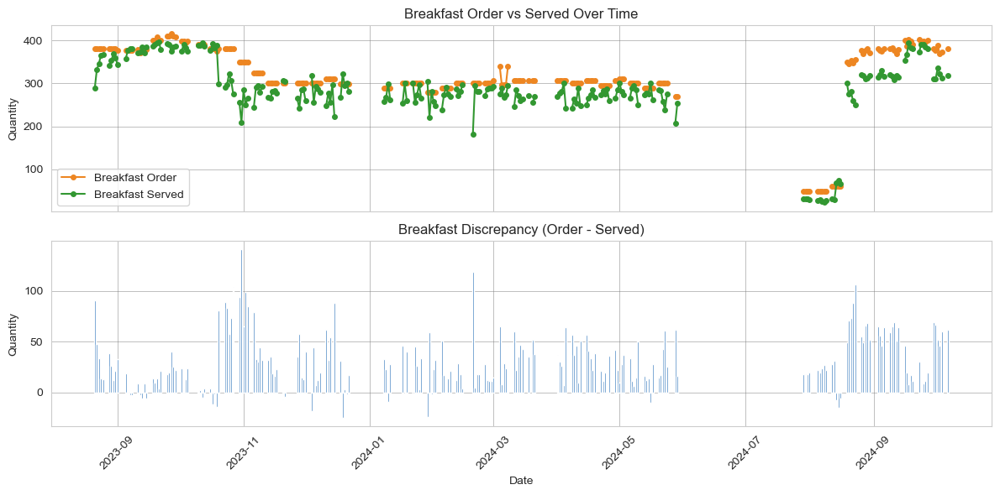
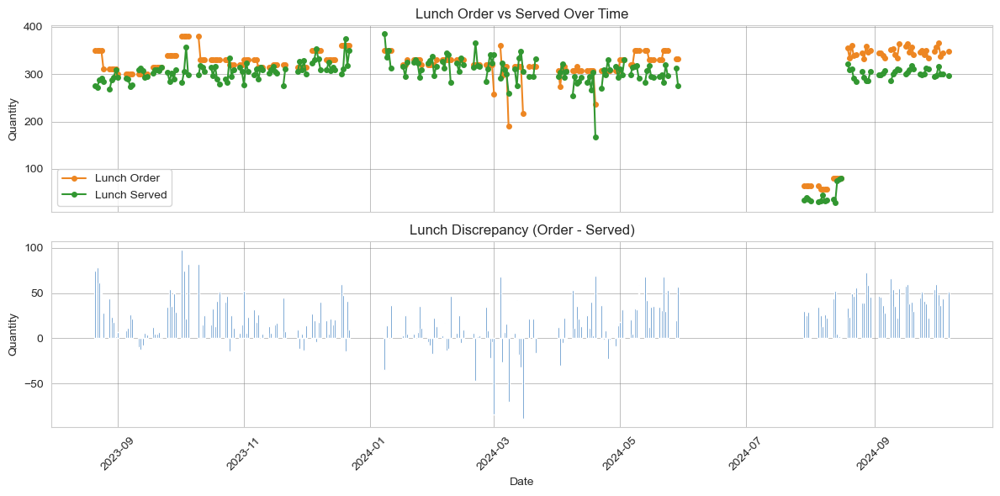
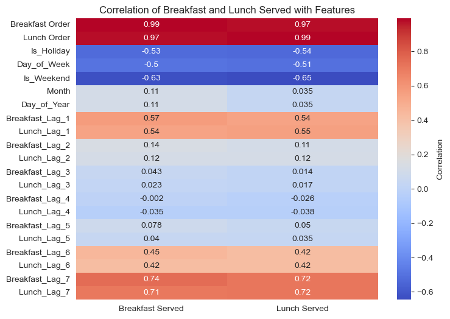
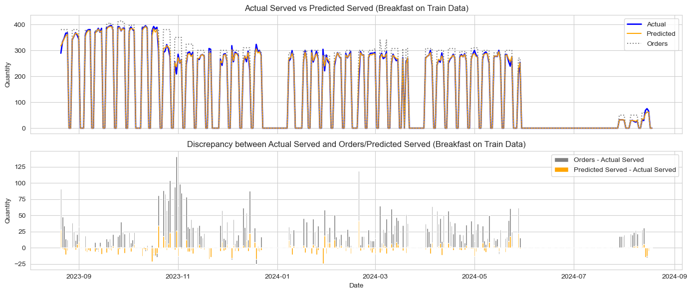
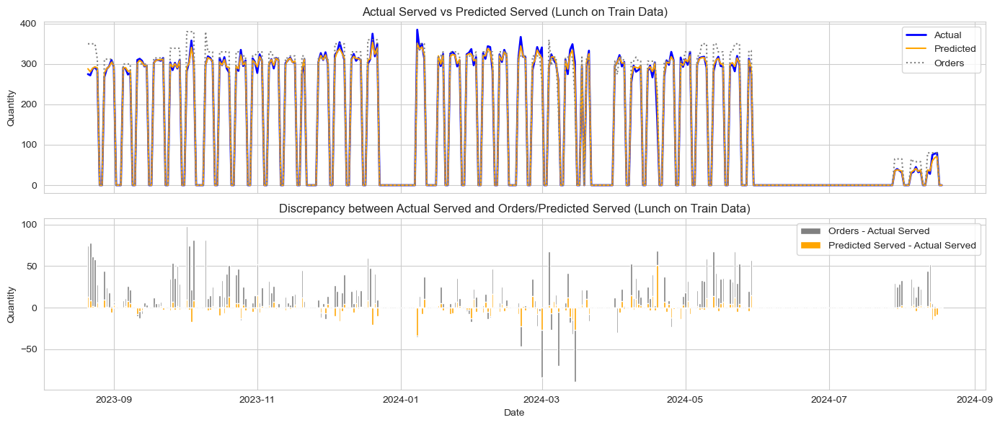
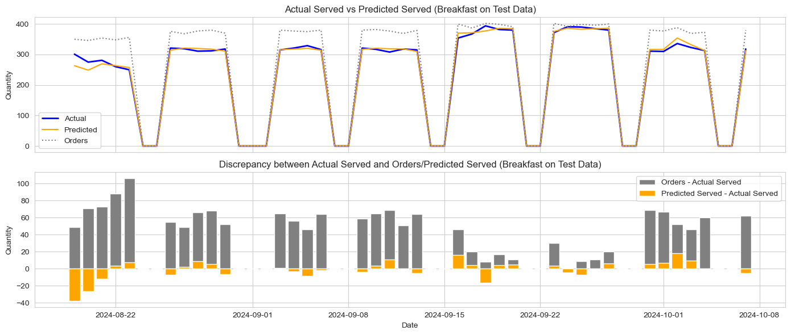
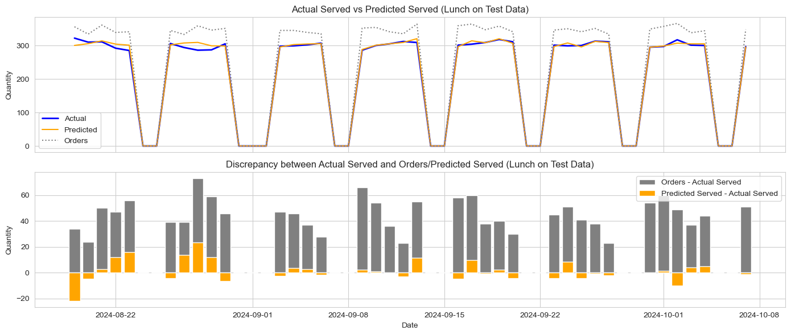
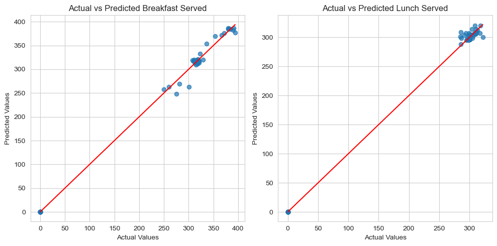

#### Background And Motivation

This project aims to forecast the number of meals served for breakfast and lunch on a given day. The primary objective is to minimize waste by accurately estimating demand, ensuring efficient meal preparation, and avoiding both shortages and overproduction. I initiated this project to address challenges in optimizing meal service operations, such as reducing inventory waste and improving customer satisfaction by ensuring timely availability of meals. By leveraging historical data and machine learning, the goal is to create a robust prediction model that enhances operational efficiency and supports better decision-making in meal planning.

#### Task Type

The task involves predicting the number of meals served based on a combination of current-day information (e.g., month, weekday, holidays) and past data (e.g., meal order quantities and served quantities over the last seven days). This is a classic regression problem, and the goal is to predict a continuous numerical value.

#### Plan

Given the relatively small dimensionality of the features, the Random Forest regression model was chosen for its ability to handle nonlinear relationships and interactions between features effectively.

#### Available Data

The dataset includes daily records of meal orders and served quantities for breakfast and lunch. Visualizations have been used to illustrate patterns and trends in the data. For example:

   Graph 1 provides an overview of daily order and served trends of breakfast orders and the discrepancy over time.

   Graph 2 provides an overview of daily order and served trends of lunch orders and the discrepancy over time.

##### Data Cleaning

Some dates in the dataset were missing records or contained null values due to school closures (e.g., holidays, weekends, or other disruptions). These entries were cleaned to ensure consistent and reliable data for training the model.

#### Feature Extraction

Key features were selected based on domain knowledge and statistical analysis. Initial features included:
   Calendar-based variables such as month, weekday, and holidays.
   Lag features such as served and ordered quantities over the past seven days.
To refine the feature set, Pearson correlation coefficients were calculated to identify the most relevant predictors. This approach ensured that only the most impactful variables were included in the model.

#### Results

Training Data Predictions

The Random Forest model demonstrated strong predictive capabilities on the training data, where the predicted served quantities closely matched the actual values. The results showed a significant reduction in the gap between orders and served quantities, minimizing potential waste.

Testing Data Predictions

On the testing data, the model maintained reasonable accuracy, with predictions aligning well with actual served values. Analysis revealed:
1. The predicted served quantities were consistently closer to actual served amounts compared to using raw order quantities.
2. In most cases, the predictions slightly exceeded the actual served quantities. This is desirable as it avoids shortages while keeping waste within acceptable limits.
3. A few instances showed predicted served quantities falling below actual values, particularly at the beginning of the school term, when reliable lag features were unavailable. Adjustments based on order quantities during such periods can mitigate this issue.

#### Analysis

Detailed analysis of breakfast predictions on the test set highlights the following:
   Prediction Gap: The gap between predicted and actual served quantities is significantly smaller than the gap between orders and actual served quantities.
   Overestimation Benefits: Slightly over-predicting served quantities ensures sufficient food is prepared while controlling waste.
   Adjustments: During certain periods, predictions underestimated actual served quantities, particularly when reliable lag data was missing. A buffer of 25 meals was calculated as an optimal adjustment to cover nearly all scenarios without significantly increasing waste.

#### Conclusion

This project showcases the effectiveness of machine learning in optimizing meal service operations. By accurately forecasting served quantities, this approach reduces waste, ensures adequate meal preparation, and enhances operational efficiency. The methodology and insights can be applied to other domains requiring demand forecasting and resource allocation, demonstrating the value of data-driven decision-making.